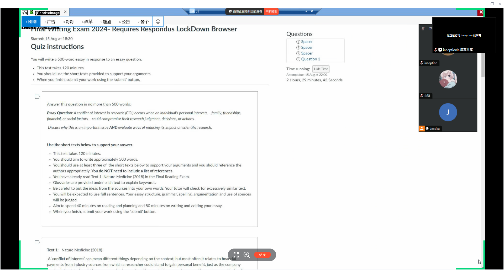
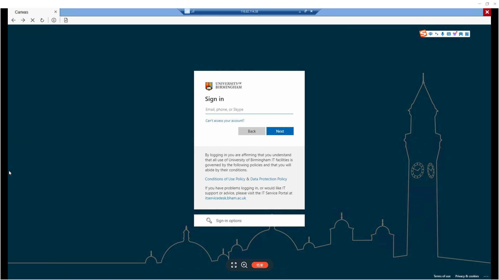
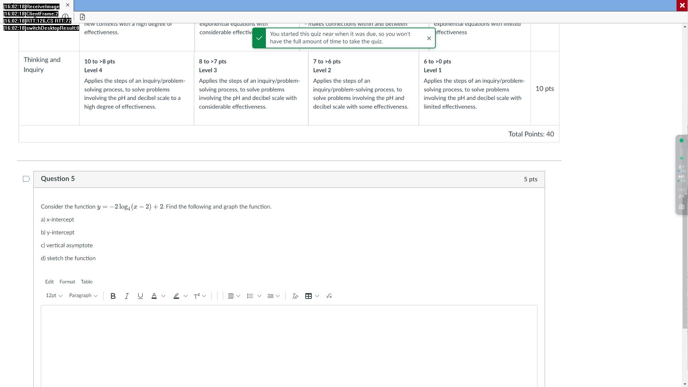
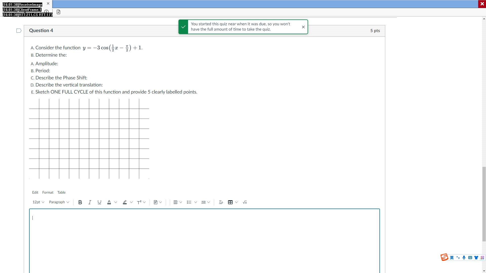
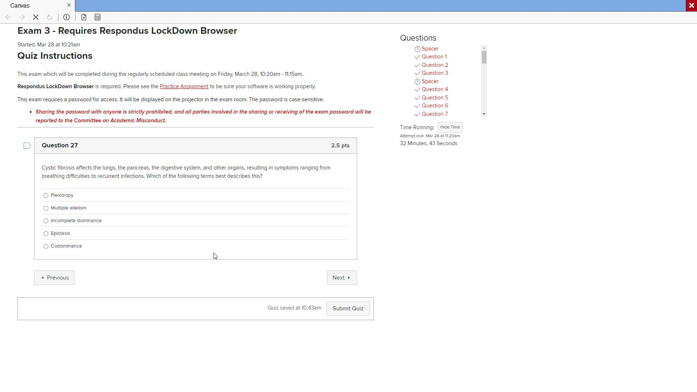
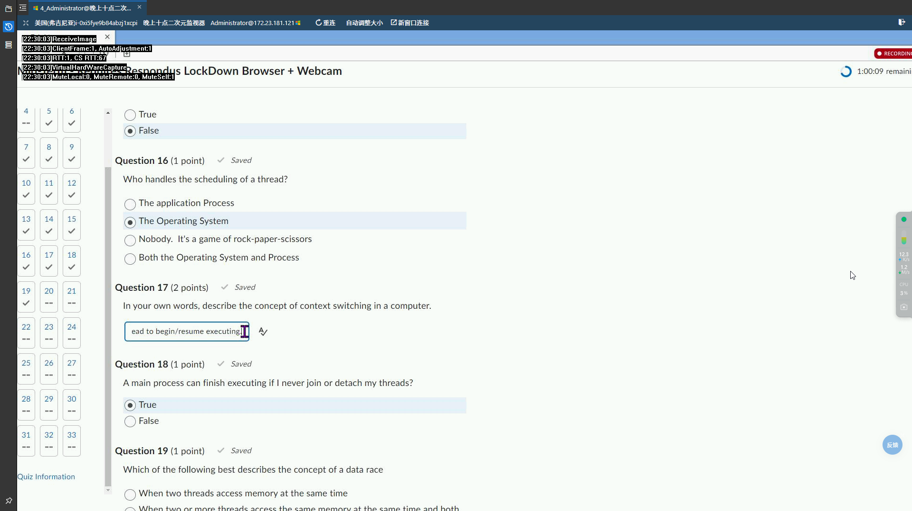
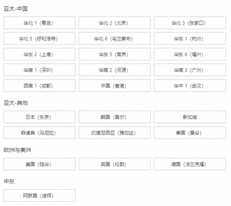

LockDownBroswer专用远程软件

以下简称LockDownBroswer为LDB

用过LDB的小伙伴都知道，这款软件禁用了绝大多数的社交通讯软件与远程控制软件，比如向日葵、toDesk、rustDesk与WhatsApp、QQ、WeChat。
而且所有的远程控制软件在建立控制连接的时候，都会弹窗提示，这种弹窗极容易被LDB检测到，从而捕捉屏幕截图，并且报告给学校。如果你的网络环境不稳定，极容易被LDB发现。

其次这个软件会检测你是否有切屏和快捷键行为，之前使用win+TAB确实可以切换桌面，但是LDB在检测到你不在LDB的页面中的时候，也会检测到，并且弹窗警告，甚至报告学校。

LDB在今年全面升级了黑屏保护（DRM），对于学校来说，学校的IT管理员可以轻松地将黑屏应用于每一场考试，而常见的远控软件要么被屏蔽，要么会被黑屏保护给屏蔽，从而无法获取考试界面。

因此我们想要在LDB下进行远程控制，必须使用专门的软件来获取画面、控制键盘鼠标。

我们团队开发了一款专门用于LDB下的远程控制软件，有专人来负责安装、配置软件并保证每一场考试的顺利进行。

如果你有想绕过LDB来远程考试的需求，请联系我们。

WeChat: Wonderful_U_010224

海外用户可以使用海外版本的微信

Mail:   bfzgsz@foxmail.com

***Remote Software Specifically for LockDownBrowser***

Hereinafter referred to as LockDownBrowser (LDB).

For those who have used LDB, you know that this software disables most social communication and remote control software, such as SunLogin, toDesk, rustDesk, WhatsApp, QQ, and WeChat. Moreover, whenever a remote control software attempts to establish a connection, a pop-up notification appears, which is easily detected by LDB, leading to screen capture and a report being sent to the school. If your network environment is unstable, it is highly likely that LDB will detect it.

Additionally, this software monitors whether you are switching screens or using shortcut keys. Previously, using Win+TAB could indeed switch desktops, but if LDB detects that you are not on its page, it will also trigger a detection, and a pop-up warning will appear, or it might even report to the school.

LDB has fully upgraded its black screen protection (DRM) this year. For schools, the IT administrators can easily apply black screen protection to every exam. Common remote control software is either blocked or cannot capture the exam interface due to the black screen protection.

Therefore, if we want to perform remote control under LDB, we must use specialized software to capture the screen and control the keyboard and mouse.

Our team has developed a remote control software specifically for use under LDB, with dedicated personnel responsible for installation, configuration, and ensuring the smooth conduct of every exam.

If you have a need to bypass LDB for remote exams, please contact us.

WeChat: Wonderful_U_010224

Overseas users can use the overseas version of WeChat

Mail:   bfzgsz@foxmail.com

---

# 收费细则 V2.2

## 一、软件功能

| **软件功能**             | **标准版**                   | **高级版**                 |
| ------------------------ | ---------------------------- | -------------------------- |
| 键鼠操作                 | 使用软件API                  | 使用硬件API                |
| 软件捕获画面             | √                            | √                          |
| DRM破解                  | ×                            | √                          |
| 屏蔽主控方键鼠操作       | ×                            | √（插件支持）              |
| 屏蔽考试机键鼠操作       | ×                            | √（插件支持）              |
| 自动重连                 | √                            | √                          |
| 快捷键                   | ×                            | ×                          |

### 注释：
1. **DRM破解**：Lockdown的黑屏保护，如果使用标准版发现进入考试界面时界面变黑，则说明本次考试启用了DRM保护。
2. **快捷键**：所有使用CTRL、ALT键的快捷键均已被屏蔽，未来可能会支持，但不建议使用，因为Lockdown有自己的快捷键检测逻辑。
3. **屏蔽主控方键鼠操作**：为了防止在巡考到来时写手仍在操控电脑从而被发现作弊行为，考试机支持屏蔽主控方的键鼠操作。注意，主控方有解除屏蔽的功能（单独付费项）。
4. **屏蔽考试机键鼠操作**：支持屏蔽考试机是为了在考试时假装对简答题进行作答，而不影响远程控制（单独付费项）。

## 二、收费标准（机构价格）

| **收费项目**            | **标准版**                                             | **高级版**                                             |
| ----------------------- |-----------------------------------------------------|-----------------------------------------------------|
| 软件配置费用            | 25元/台，一般考试写手各需要一台。后续相同机器在3次考试内不重复收取配置费用（卸载软件需重新收费）。 | 主控方25元/台，被控方50元/台。后续相同机器在3次考试内不重复收取配置费用（卸载软件需重新收费）。 |
| 测试费用                | 1小时内不收费，超过1小时按照40元/小时的标准收费。                         | 与标准版相同。                                             |
| 基础时长费用            | 100元/小时。                                            | 200元/小时。                                            |
| 非跨境流量费用          | 10元/小时。                                             | 与标准版相同。                                             |
| 跨境流量费用            | 40元/小时。                                             | 与标准版相同。                                             |
| 中转流量费用            | 20元/小时（参照其他说明第3条）。                                  | 与标准版相同。                                             |
| 代填答案（需要预约）     | 80元/小时。                                              | 与标准版相同。                                             |
| 优惠                    | 每2小时赠送1小时远控时长（仅本次可用）。                               | 不参与优惠，但我们可能视情况抹零。                                   |
| 屏蔽主控方键鼠操作       | 不支持。                                                | 10元/小时。                                             |
| 屏蔽考试机键鼠操作       | 不支持。                                                | 10元/小时。                                             |

## 三、其他说明：
1. 按时收费的项目，除另行说明以外，均按本规则计价：超时15分钟（包含15分钟）内不收费，超时15分钟，按照一小时收费且最低按一小时计费（按考试总时长计费）。
2. **跨境流量**：当写手与被控方不在同一区域内（一般以国家为单位），视为跨境流量。由于跨境流量费用异常昂贵，故这部分流量需要另行支付。
3. **中转服务器**：我们提供中转服务器，这样可以大幅降低跨境流量的消耗，节省大量的流量费用，但部分地域可能无法提供这个服务。

## 四、适用平台

### 被控方：
- **Windows：**
    - Windows10：1607及以上版本
    - Windows11：全平台支持

### 主控方：
1. **Mac OS**：MacOS 11及以上。
2. **iPad OS**：16.0及以上。
3. **Windows**：Win10及以上。
4. **Android**：Android9及以上（需要支持Google Play）。

## 五、常见疑问：
1. **我该选择哪个版本？**
   除非特别肯定，都应该选择高级版，假设你的学校突然更新了DRM保护，使用标准版本会无法截取画面从而导致考试失败，选择标准版代表着自愿承担失败的风险，且因DRM保护而导致失败的考试不退还费用。

2. **会被LDB检测到吗？**
   不会，本程序完全处于LDB的检测范围之外，且本程序使用的技术比LDB更复杂，操作权限在LDB之上，也不会破坏LDB程序的完整性。但值得注意的是：你的电脑上如果出现其他弹窗软件（比如鲁大师广告插件）导致的弹窗检测，本软件概不负责。

3. **服务结束后，你们是否会随时控制我的电脑？**
   每个客户都分配了独立的服务器与账号密码，且仅在考试与测试期间可用，考试一旦完成，这些资源便会被销毁。我们不会尝试控制你的电脑，也不会尝试留下后门，我们无心窥探客户隐私，若不放心，可以在考试结束后卸载软件。

4. **我需要预约吗？**
   是的，需要预约，最好是提前2天以上预约，这样若出现问题也有时间调整，如果当天预约的话，可能会腾不开人手来配置。

5. **你们软件支持的分辨率为多少？**
   目前主控方与被控方支持任意分辨率，但不支持画面缩放功能，后续会逐渐支持画面缩放功能。

6. **你们目前在哪里有架设服务器？**
   截止2024年10月4日，我们在以下地区架设了服务器，我们会根据被控方所在的地区来决定具体使用哪个服务器（就近原则）。
   

## 六、已知问题：
1. **蓝牙键盘和有线键盘无法使用**：考试后联系我们，我们会卸载与系统不兼容的组件。
2. **电脑重启后再启动高级版会发生闪退**：这是因为电脑的某些安全软件会阻止本程序，需要重新安装软件驱动，请在考试前至少保留十分钟的时间，并在我们的指导下重新安装驱动。

---

# Charging Details V2.2

## I. Software Features

| **Feature**                              | **Standard Edition**               | **Advanced Edition**              |
| ---------------------------------------- | ---------------------------------- | --------------------------------- |
| Mouse and Keyboard Operation             | Use Software API                   | Use Hardware API                  |
| Screen Capture                           | √                                  | √                                 |
| DRM Bypass                               | ×                                  | √                                 |
| Block Main Control's Mouse/Keyboard      | ×                                  | √ (Plugin Support)                |
| Block Exam Machine's Mouse/Keyboard      | ×                                  | √ (Plugin Support)                |
| Auto Reconnect                           | √                                  | √                                 |
| Hotkeys                                  | ×                                  | ×                                 |

### Notes:
1. **DRM Bypass**: Lockdown black screen protection. If the screen turns black during the exam in Standard Edition, it means DRM protection is enabled.
2. **Hotkeys**: All hotkeys using CTRL and ALT are disabled. They may be supported in the future, but using them is not recommended due to Lockdown's hotkey detection logic.
3. **Block Main Control's Mouse/Keyboard**: This prevents proctors from noticing the writer's activity during the exam. However, the main control has the ability to unblock this (paid feature).
4. **Block Exam Machine's Mouse/Keyboard**: This allows the examinee to pretend to answer essay questions without interrupting the remote control (paid feature).

## II. Pricing(Institutional Price)

| **Charge Item**                          | **Standard Edition**                                                                                            | **Advanced Edition**                                                                                                                            |
| ---------------------------------------- |-----------------------------------------------------------------------------------------------------------------|-------------------------------------------------------------------------------------------------------------------------------------------------|
| Software Setup Fee                       | 25 CNY per machine. No charges for the same machine within 3 exams (Uninstalling requires reconfiguration fee). | Main control: 25 CNY per machine. Controlled side: 50 CNY per machine. No recharges within 3 exams (Uninstalling requires reconfiguration fee). |
| Test Fee                                 | Free for the first hour. 40 CNY per additional hour.                                                            | Same as Standard Edition.                                                                                                                       |
| Base Duration Fee                        | 100 CNY per hour.                                                                                               | 200 CNY per hour.                                                                                                                               |
| Non-Cross-Border Data Fee                | 10 CNY per hour.                                                                                                | Same as Standard Edition.                                                                                                                       |
| Cross-Border Data Fee                    | 40 CNY per hour.                                                                                                | Same as Standard Edition.                                                                                                                       |
| Relay Data Fee                           | 20 CNY per hour (See other notes).                                                                              | Same as Standard Edition.                                                                                                                       |
| Answer Filling Service (Appointment Required) | 80 CNY per hour.                                                                                                | Same as Standard Edition.                                                                                                                       |
| Discount                                 | 1 free hour for every 2 paid hours (valid only for current session).                                            | Not applicable to discounts.                                                                                                                    |
| Block Main Control's Mouse/Keyboard      | Not supported.                                                                                                  | 10 CNY per hour.                                                                                                                                |
| Block Exam Machine's Mouse/Keyboard      | Not supported.                                                                                                  | 10 CNY per hour.                                                                                                                                |

## III. Other Notes:
1. All timed items are charged per hour, unless otherwise stated. If usage exceeds 15 minutes, it will be charged as one full hour.
2. **Cross-Border Data**: Cross-border applies if the writer and controlled machine are in different countries. Cross-border data is expensive and charged separately.
3. **Relay Servers**: We offer relay servers to reduce cross-border data costs significantly. However, this service may not be available in all regions.

## IV. Supported Platforms

### Controlled Side:
- **Windows:**
    - Windows 10: Version 1607 or higher.
    - Windows 11: Fully supported.

### Main Control Side:
1. **Mac OS**: Version 11 or higher.
2. **iPad OS**: Version 16.0 or higher.
3. **Windows**: Windows 10 or higher.
4. **Android**: Version 9 or higher (Requires Google Play).

## V. Frequently Asked Questions:

1. **Which version should I choose?**
   Unless you're certain, it's recommended to choose the Advanced Edition. If your school updates DRM protection unexpectedly, the Standard Edition may fail to capture the screen, leading to exam failure. No refunds will be given for exams failed due to DRM protection.

2. **Will it be detected by LDB?**
   No, this program operates outside LDB's detection scope, using technology more advanced than LDB's. It will not interfere with the integrity of the LDB program. However, we are not responsible for issues caused by other popup software like system ads.

3. **Will you control my computer after the service ends?**
   No, each client is assigned a unique server and account password, which is only active during the exam and testing period. After the exam, all resources are destroyed. You may uninstall the software if you feel uneasy.

4. **Do I need to make a reservation?**
   Yes, it is recommended to book at least 2 days in advance to allow time for adjustments if issues arise.

5. **What resolutions are supported?**
   Currently, both the main control and controlled side support only 1080P (1920*1080). Screen scaling is not supported but may be added in future updates.

6. **Where are your servers located?**
   As of October 4, 2024, servers are located in various regions and selected based on the controlled machine's location.

## VI. Known Issues:
1. **Bluetooth and Wired Keyboards Not Working**: After the exam, contact us to uninstall incompatible components.
2. **Crash After Restart with Advanced Edition**: Some security software may block the program, requiring driver reinstallation. Allow at least 10 minutes before the exam for this process.
