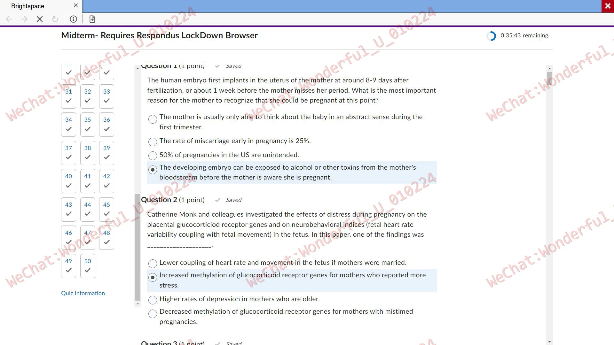
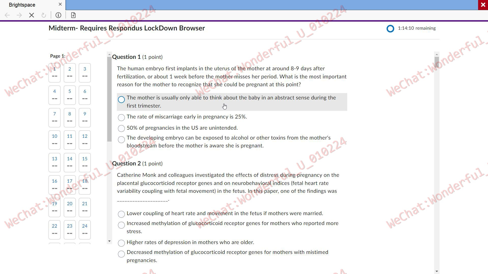
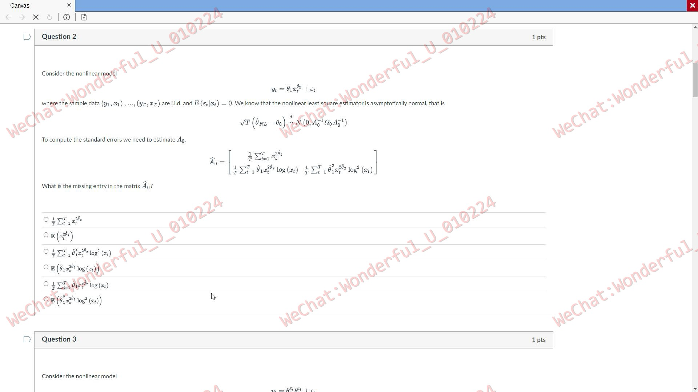
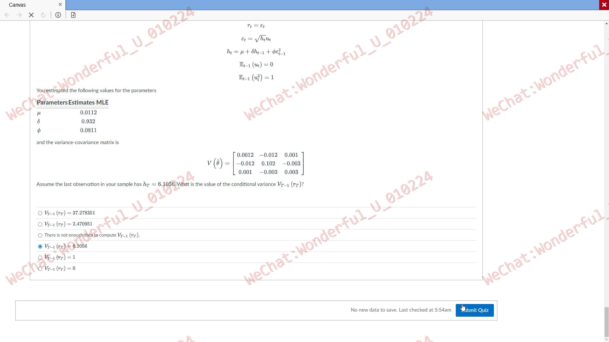

# LockdownBrowser专用远程软件（以下简称LDB）

使用过LDB的小伙伴应该都知道，这款软件禁用了大多数的社交通讯和远程控制软件，如：向日葵、ToDesk、RustDesk、WhatsApp、QQ、WeChat等。
在建立远程控制连接时，主流的远程控制软件通常会弹出提示窗口，而这些窗口极易被LDB检测到，从而触发屏幕截图并报告给学校。
如果网络环境不稳定，LDB也可能会检测到异常情况。

LDB还能够通过读取系统事件来检测是否有切屏、快捷键以及远程复制粘贴的行为。
LDB能够监控当前浏览器的活动窗口，如果发现用户切出考试页面，便会触发警告弹窗，视为异常操作。
同时，LDB还会检查系统剪切板，如果发现用户远程复制答案，则很可能会被标记为异常。
此外，LDB还升级了黑屏保护（DRM），学校的IT管理员可以轻松在每场考试中启用黑屏保护功能。
当一场考试发生多次异常时，LDB会向学校报告这些问题。
常见的远程控制软件要么被屏蔽，要么无法突破黑屏保护，导致无法获取考试界面。

为了方便学生在LDB环境下进行远程控制，我们团队特别开发了一款专用软件。
该软件采用了更加接近操作系统底层的方式来获取画面，并控制键盘和鼠标，能够完美避开LDB的检测机制。
我们的专业团队负责软件的安装和配置，并确保每一场考试顺利进行。

如果您有绕过LDB进行远程考试的需求，请联系我们，我们将为您提供专业的解决方案。

WeChat: Wonderful_U_010224

海外用户可以使用海外版本的微信

Mail:   bfzgsz@foxmail.com

# LockdownBrowser Dedicated Remote Software (hereafter referred to as LDB)

Anyone who has used LDB is likely aware that it disables most social communication and remote control software, such as AnyDesk, ToDesk, RustDesk, WhatsApp, QQ, WeChat, and others.
When establishing a remote control connection, mainstream remote control software typically prompts a notification, which can easily be detected by LDB. This leads to a screenshot being captured and reported to the school.
If the network environment is unstable, LDB may also detect anomalies.

LDB can detect system events, including screen switching, keyboard shortcuts, and remote copy-paste actions.
It monitors the active window of the browser during the exam, and if it detects that the user has switched away from the exam page, it will trigger a warning popup and mark it as suspicious behavior.
LDB also checks the system clipboard, and if it detects remote copying of answers, it will likely classify this as abnormal activity.
Additionally, LDB has upgraded its black screen protection (DRM), which allows school IT administrators to easily enable black screen protection for each exam.
If multiple anomalies occur during an exam, LDB will report these issues to the school.
Common remote control software is either blocked or unable to bypass the black screen protection, making it impossible to access the exam interface.

To help students conduct remote control in the LDB environment, our team has developed a dedicated software solution.
This software uses a method that is closer to the operating system's core to capture the screen and control the keyboard and mouse, effectively bypassing LDB's detection mechanisms.
Our professional team handles the installation and configuration of the software, ensuring that each exam runs smoothly.

If you need assistance with bypassing LDB for remote exams, please contact us, and we will provide a professional solution tailored to your needs.

WeChat: Wonderful_U_010224

Overseas users can use the overseas version of WeChat

Mail:   bfzgsz@foxmail.com

更多截图请查看screen文件夹。

For more screenshots, please check the "screen" folder.

---

## LockdownBrowser是如何检测常规远程控制行为的？

LockdownBrowser不仅可以屏蔽主流远程控制软件的使用，它能够通过多种技术手段间接识别这种作弊行为：

### 1. 行为模式异常检测

LockdownBrowser能够分析鼠标、键盘、屏幕活动和摄像头监控的行为，发现异常模式。远程控制通常会导致一些明显异常：

- **不正常的键鼠操作**：远程控制的鼠标动作可能不符合正常行为，如移动方式、速度或点击位置异常，系统可能标记为可疑。
- **输入与视频不符**：如果摄像头显示你没有操作键盘或鼠标，但屏幕上有输入操作，这种不一致会被标记为异常。

### 2. 摄像头和音频监控

LockdownBrowser会在考试期间启用摄像头和麦克风。如果你未操作键盘和鼠标，但远程操控者正在操作，系统会发现你与考试操作不一致的状态，可能触发警报。

- **面部和身体动作不一致**：如手未在键盘上、目光不在屏幕上，而电脑有操作，LockdownBrowser可判断为远程控制或作弊行为。
- **背景声音异常**：LockdownBrowser会捕捉周围声音，如你与远程操作者通话，这些声音可能被记录为潜在作弊证据。

### 3. IP地址和网络监控

LockdownBrowser会检测考试期间的IP地址和网络连接。如果远程控制工具通过不同IP地址连接，系统会发现以下异常：

- **IP地址变化**：如果网络连接突然改变，可能触发警报。
- **多设备检测**：如果系统检测到考试通过不同设备进行（如通过远程控制连接），会识别出异常网络活动。

### 4. 软件使用检测

LockdownBrowser能够限制或监控某些应用的使用。如果你试图运行远程控制软件，如TeamViewer或AnyDesk，LockdownBrowser可能限制这些程序启动或检测其后台运行。

- **禁止切换应用**：LockdownBrowser可能阻止你切换到其他程序，如使用 **Alt+Tab** 切换到远程控制工具，系统会记录这种行为。
- **系统行为异常**：即使LockdownBrowser无法直接识别远程控制软件的名称，也能通过系统资源的使用情况或窗口行为检测到不正常的系统活动。

### 5. 考试后复查

LockdownBrowser会录制整个考试过程，供监考人员或管理员事后复查。即使未立即被发现，视频和屏幕录制可以揭示你未操作鼠标和键盘，而远程控制者在操作的情况，监考人员可以通过视频回放发现作弊行为。

## How Does LockdownBrowser Detect Conventional Remote Control Behaviors?

LockdownBrowser can directly detect the use of remote control software, it can indirectly identify such cheating behaviors through various technical means:

### 1. Abnormal Behavior Pattern Detection

LockdownBrowser can analyze mouse, keyboard, screen activities, and camera-monitored behaviors to detect abnormal patterns. Remote control often leads to some obvious irregularities:

- **Unusual Mouse and Keyboard Operations**: Remote-controlled mouse movements may not conform to normal behavior, such as abnormal movement patterns, speed, or click locations, and the system might flag this as suspicious.
- **Input Doesn’t Match Video**: If the camera shows that you are not operating the keyboard or mouse, but there is input activity on the screen, this inconsistency will be marked as suspicious behavior.

### 2. Camera and Audio Monitoring

LockdownBrowser will enable the camera and microphone during the exam. If you are not operating the keyboard and mouse, but a remote operator is, the system will notice the discrepancy and might trigger an alert.

- **Inconsistent Facial and Body Movements**: If your hands are not on the keyboard or your gaze is not on the screen while the computer is performing actions, LockdownBrowser can infer that remote control or cheating is taking place.
- **Unusual Background Sounds**: LockdownBrowser can capture ambient sounds, and if you are speaking with a remote operator (e.g., via phone or voice software), these sounds may be recorded as potential cheating evidence.

### 3. IP Address and Network Monitoring

LockdownBrowser monitors the IP address and network connection during the exam. If remote control tools connect through different IP addresses, the system will detect the following abnormalities:

- **IP Address Change**: If your network connection suddenly changes, it might trigger an alert.
- **Multiple Device Detection**: If the system detects that the exam is being conducted on different devices (e.g., through remote control connections), it can identify this abnormal network activity.

### 4. Software Usage Detection

LockdownBrowser can limit or monitor the usage of certain applications. If you attempt to run remote control software such as TeamViewer or AnyDesk, LockdownBrowser may restrict these programs from launching or detect them running in the background.

- **Blocking Application Switching**: LockdownBrowser may prevent you from switching to other programs, such as using **Alt+Tab** to switch to remote control tools, and the system will record this behavior.
- **Abnormal System Behavior**: Even if LockdownBrowser cannot directly identify the specific name of remote control software, it can detect unusual system activity based on system resource usage or window behavior.

### 5. Post-Exam Review

LockdownBrowser records the entire exam process for invigilators or administrators to review afterward. Even if you were not immediately detected during the exam, the video and screen recordings may reveal situations where you did not operate the keyboard and mouse while a remote controller did. The invigilators can replay the video to find clues of remote control behavior.

## 一、软件功能

| **软件功能**             | **高级版** |
| ------------------------ |---------|
| 键鼠操作                 | 使用硬件API |
| 软件捕获画面             | √       |
| DRM破解                  | √       |
| 屏蔽主控方键鼠操作       | √       |
| 屏蔽考试机键鼠操作       | √       |
| 自动重连                 | √       |
| 快捷键                   | √       |

### 注释：
1. **DRM破解**：HL的黑屏保护，如果使用标准版发现进入考试界面时界面变黑，则说明本次考试启用了DRM保护。
2. **快捷键**：所有使用CTRL、ALT键的快捷键均支持，但不建议使用，因为HL有自己的快捷键检测逻辑。
3. **屏蔽主控方键鼠操作**：为了防止在巡考到来时写手仍在操控电脑从而被发现作弊行为，考试机支持屏蔽主控方的键鼠操作。注意，主控方有解除屏蔽的功能。
4. **屏蔽考试机键鼠操作**：支持屏蔽考试机是为了在考试时假装对简答题进行作答，而不影响远程控制。

## 二、定价与退款规则（机构价格）

### 定价规则：
一场考试由以下几部分费用组成：
1. **基础费用（Basic Price）**
   该部分费用可以理解为考试的起步价，是每一场考试都会收取的费用。
2. **测试费用（Test Price）**
   该部分费用为测试时间的费用，每半个小时为一次计费单元，因此会按照每半个小时进行一次收费，不足半个小时的按半个小时收费，但会减免一个小时的费用。
3. **考试费用（Exam Price）**
   该部分费用为考试时间的费用，每半个小时为一次计费单元，最低收费时间为一个小时（也就是考试时间单元数最低为2），之后每半个小时进行一次收费。
4. **服务器的租赁费用（Server Price）**
   该部分费用用来租赁服务器，按天收费，不足一天的按一天计算。

**总价** = 基础费用 + 距离考试的天数 * 服务器的租赁费用 +  max(0，（测试时间单元数-2）) * 测试时间单价 + 考试时间单元数 * 考试时间单价。

**特殊说明**：
- 如果需要提前连接，可以在创建排期时将时间提前半个小时。若这半个小时没有进入考试页面，则这部分时间按测试时间计价（但不参与减免），具体扣费以服务器日志为准。

向后调整考试时间会再次收取服务器费用。这部分的定价公式为：
1. 向后调整的秒数 = 目标时间 - 原来的考试时间
2. 向后调整的天数 = 向上取整（向后调整的秒数/24/3600）
3. 收取的费用 = 向后调整的天数 * Server Price

### 退款规则：
发生退款时，系统计算以下变量，并根据排期的不同状态来计算退款金额：

- **Server Cost**：距离考试时间的剩余天数（向下取整，不足24小时按0计算） * Server Price。
- **Test Cost Full**：max(0，（测试时间单元数-2）) * 测试时间单价。
- **Test Cost**：减免的测试时间单元数 * 测试时间单价。
- **Exam Cost**：max(2，考试时间单元数) * 考试时间单价

1. **学生未确认或者学生拒绝排期**：
   退款金额 = Server Cost + Exam Cost + Test Cost Full + Basic Price。
2. **学生确认排期，但在测试时间之前**：
   退款金额 = （Server Cost + Test Cost Full – Test Cost） * 0.5 + Exam Cost + Basic Price * 0.7。
3. **在测试时间以后，但在考试时间之前**：
   退款金额 = （Server Cost + Exam Cost + Basic Price） * 0.3。
4. **由于部分情况异常，退款金额可能无法正确计算，出现这种情况请及时联系我们**。
5. **如果提前结束考试**，需要手动关闭服务器（不允许再启动或重启服务器，否则会继续计费）后，联系我们说明具体场次考试已经提前结束。我们会审查服务器日志，并进行退款，未使用的考试时长退一半费用。比如预定了三个时间单元，但是只使用了两个时间单元，那么退款时第三个时间单元会退一半。
6. **如果测试失败了**，可以全额退款，这种情况需要联系我们。因为自动退款的逻辑不会全额退款。

## 三、适用平台

### 被控方：
- **Windows：**
    - Windows 10：1607及以上版本
    - Windows 11：全平台支持

### 主控方：
1. **Mac OS**：MacOS 11及以上（需要云电脑，此处为单独收费项）。
2. **Windows**：Win10及以上。
## 四、其他说明与常见疑问

1. **会被 LDB 检测到吗？**
   不会，本程序完全处于 LDB 的检测范围之外，且本程序使用的技术比 LDB 更复杂，操作权限在 LDB 之上，也不会破坏 LDB 程序的完整性。但值得注意的是：如果你的电脑上出现其他弹窗软件（例如鲁大师广告插件）导致的弹窗检测，本软件概不负责。

2. **服务结束后，你们是否会随时控制我的电脑？**
   每个客户都分配了独立的服务器与账号密码，且仅在考试与测试期间可用，考试一旦完成，这些资源便会被销毁。我们不会尝试控制你的电脑，也不会尝试留下后门。我们无心窥探客户隐私，若不放心，可以在考试结束后卸载软件。

3. **我需要预约吗？**
   是的，需要预约，最好提前 2 天以上预约，这样若出现问题也有时间进行调整。

4. **你们软件支持的分辨率为多少？**
   目前主控方与被控方仅在相同分辨率下进行控制。

5. **被控端蓝牙键盘和有线键盘无法使用：**
   请重新拔插鼠标，如果恢复正常，先凑活使用，考后执行软件清理即可。

6. **主控端键鼠异常：**
    - **鼠标无法使用**：请在被控端的“Advanced Options” -> “Program Parameter” -> 勾选“Enable Use Win Mouse”，并在后方的输入框输入数字1，然后点击“Save”按钮。重启电脑后再次测试。
    - **键盘无法使用**：被控端电脑与程序不兼容，需要更换电脑。

7. **电脑重启后再启动高级版会发生闪退**
   这是因为电脑的某些安全软件会阻止本程序，需要重新安装软件驱动。请在考试前至少保留十分钟的时间，并在我们的指导下重新安装驱动。这个问题会在配置的过程中出现，不会在考试时突然发生。

8. **部分游戏不能启动或者反作弊引擎报错**
   目前主流的游戏反作弊系统需要开启 Secure Boot，但本软件在大多数电脑上均不能在 Secure Boot 模式下运行，因此该问题无法解决。只能在考试结束后执行软件清理步骤，再恢复 Secure Boot。

   目前已知不兼容的反作弊系统与游戏：
    - 瓦洛兰特（国服与国际服）
    - Riot Vanguard 反作弊系统
    - FACEIT游戏平台

9. **监考软件提示关闭双显示器**
   该问题与本软件核心组件冲突，导致该学校的监考软件无法使用。

10. **什么时间开放服务器操作权限？**
    测试时间的前 5 分钟与考试时间的前 10 分钟开放权限，测试时间结束与考试时间结束时收回权限（收回权限的时间会延后几分钟，但不保证）。

11. **预定的时间不够用怎么办？**
    建议在到期前 10 分钟左右返回排期列表进行延长时间操作。系统自动停止服务器时就会开始回收资源，无法进行续期操作。

12. **CPU要求：**
    支持 Intel 或者 AMD CPU，不支持晓龙 CPU。

13. **电脑要求：**
    不支持苹果电脑，包括使用苹果电脑安装的 Windows 虚拟机。

## 1. Software Features

| **Software Feature**       | **Premium Version** |
| -------------------------- | -------------------- |
| Mouse & Keyboard Operation | Uses Hardware API    |
| Software Screen Capture    | √                    |
| DRM Cracking               | √                    |
| Block Master Control Key & Mouse | √                |
| Block Exam Machine Key & Mouse | √                 |
| Auto Reconnect             | √                    |
| Hotkeys                    | √                    |

### Notes:
1. **DRM Cracking**: LDB’s blackout protection; if the interface goes black during the exam, it means DRM protection is enabled in the exam.
2. **Hotkeys**: All hotkeys using CTRL and ALT keys are supported, but it is not recommended to use them, as LDB has its own hotkey detection logic.
3. **Block Master Control Key & Mouse**: To prevent proctors from detecting cheating behavior when they arrive, the exam machine can block master control keyboard and mouse operations. However, the master control can unblock this.
4. **Block Exam Machine Key & Mouse**: The exam machine can be blocked to simulate answering essay questions without affecting remote control.

## 2. Pricing and Refund Policy (Institution Price)

### Pricing Rules:
An exam consists of the following parts:
1. **Base Price**
   This can be considered the starting fee for each exam, charged for every session.
2. **Test Fee**
   This is the fee for the test duration, charged every half hour. Any time shorter than half an hour will be charged as half an hour, but one hour of testing is waived.
3. **Exam Fee**
   This is the fee for the exam duration, charged every half hour. The minimum time charged is one hour (the minimum number of exam time units is 2). After that, it's charged every half hour.
4. **Server Rental Fee**
   This is for renting the server, charged per day. Any time less than a day will be charged as a full day.

**Total Price** = Base Price + (Days Before Exam * Server Rental Fee) + max(0, (Test Time Units - 2)) * Test Time Unit Price + (Exam Time Units * Exam Time Unit Price).

**Special Note**:
- If early connection is required, the time can be scheduled half an hour earlier. If the exam page isn’t entered in that half-hour, the time will be charged as test time (without the discount). Charges will be based on the server logs.

Adjusting the exam time later will incur additional server costs. The pricing formula for this is:
1. Adjusted Seconds = Target Time - Original Exam Time
2. Adjusted Days = Ceiling (Adjusted Seconds / 24 / 3600)
3. Fees Charged = Adjusted Days * Server Price

### Refund Policy:
Refunds are calculated based on the following variables and the status of the scheduled exam:

- **Server Cost**: Remaining days before the exam (rounded down, with less than 24 hours considered 0) * Server Price.
- **Test Cost Full**: max(0, (Test Time Units - 2)) * Test Time Unit Price.
- **Test Cost**: Discounted test time units * Test Time Unit Price.
- **Exam Cost**: max(2, Exam Time Units) * Exam Time Unit Price.

1. **Student Not Confirmed or Rejects Schedule**:
   Refund = Server Cost + Exam Cost + Test Cost Full + Base Price.
2. **Student Confirms Schedule, but Before Test Time**:
   Refund = (Server Cost + Test Cost Full - Test Cost) * 0.5 + Exam Cost + Base Price * 0.7.
3. **After Test Time, Before Exam Time**:
   Refund = (Server Cost + Exam Cost + Base Price) * 0.3.
4. **Due to Some Abnormalities, Refund Calculation May Be Incorrect. Please Contact Us.**
5. **If Exam Ends Early**, the server must be manually closed (it cannot be started or restarted) and contact us with specific details. We will review the server logs and refund unused exam time. For example, if you booked three time units but used only two, the third time unit will be refunded half.
6. **If the Test Fails**, a full refund is possible. Please contact us, as the automatic refund logic won't refund the full amount.

## 3. Supported Platforms

### Controlled Side:
- **Windows**:
    - Windows 10: Version 1607 and above
    - Windows 11: Fully supported

### Controlling Side:
1. **Mac OS**: MacOS 11 and above (requires cloud computer, which is a separate charge).
2. **Windows**: Windows 10 and above.

## 4. Additional Information & Frequently Asked Questions

1. **Will LDB detect this?**
   No, this program is fully outside LDB’s detection range. It uses more advanced technology than LDB, with control permissions above LDB, and does not damage the integrity of LDB. However, if other pop-up software (such as LuMaster ad plugins) causes pop-up detection, the software is not responsible.

2. **Will you ever control my computer after the service ends?**
   Each customer is assigned a unique server with an account password, only available during the exam and test periods. Once the exam is complete, these resources are destroyed. We do not attempt to control your computer or leave backdoors. If you are concerned, you can uninstall the software after the exam.

3. **Do I need to make a reservation?**
   Yes, you need to make a reservation, preferably more than 2 days in advance, to allow time for adjustments if issues arise.

4. **What resolution is supported by your software?**
   Currently, control between the controlling side and the controlled side is only possible with the same resolution.

5. **Bluetooth Keyboard and Wired Keyboard Not Working on Controlled Side:**
   Please reconnect the mouse. If it works, you can use it temporarily, and perform software cleaning after the exam.

6. **Abnormal Keyboard and Mouse on Controlling Side:**
    - **Mouse Not Working**: Go to “Advanced Options” -> “Program Parameter” on the controlled side, check “Enable Use Win Mouse,” input number 1 in the box, and click "Save." Restart the computer and test again.
    - **Keyboard Not Working**: The controlled computer is incompatible with the program; please change computers.

7. **Crash After Restart When Starting Premium Version**
   This occurs due to certain security software blocking the program. Please reinstall the software driver under our guidance at least ten minutes before the exam. This issue occurs during configuration and won't suddenly happen during the exam.

8. **Some Games Can't Start or Anti-Cheat Engine Errors**
   The software doesn't work under Secure Boot mode, which is required by many mainstream anti-cheat systems. The issue cannot be resolved. After the exam, you can perform software cleanup and restore Secure Boot.

   Known incompatible anti-cheat systems and games:
    - Valorant (both Chinese and international versions)
    - Riot Vanguard Anti-Cheat System
    - FACEIT Platform

9. **Proctoring Software Prompts to Close Dual Monitors**
   This conflict with the core components of the software causes issues with the proctoring software.

10. **When is the server operation permission open?**
    The operation permission opens during the first 5 minutes of the test time and the first 10 minutes of the exam time. Permissions are revoked at the end of the test time and exam time (revocation may be delayed, but not guaranteed).

11. **What if the scheduled time is insufficient?**
    It’s recommended to extend the time at least 10 minutes before the scheduled time ends. The system will start recovering resources once the server stops automatically, and no further extension can be made.

12. **CPU Requirements**:
    Supports Intel or AMD CPUs; Snapdragon CPUs are not supported.

13. **Computer Requirements**:
    Apple computers are not supported, including those running Windows on virtual machines.
